# INFORMATION ASSURANCE AND SECURITY - FINAL PROJECT
## Submitted by **Group 11 - BSCS 3B**
- Edioma, Angela Mae F.
- Espion, Paolo L.
- Hertez, Mary Grace B.
- Martirez, Lloyd Draizen L.

# Raspberry Pi Installation Guide

## 1. Prepare and Install Headless Raspian OS in Raspberry Pi

- ### Download Raspbian OS

- ### Visit the [Official Raspberry Pi Website](https://www.raspberrypi.com/software/)

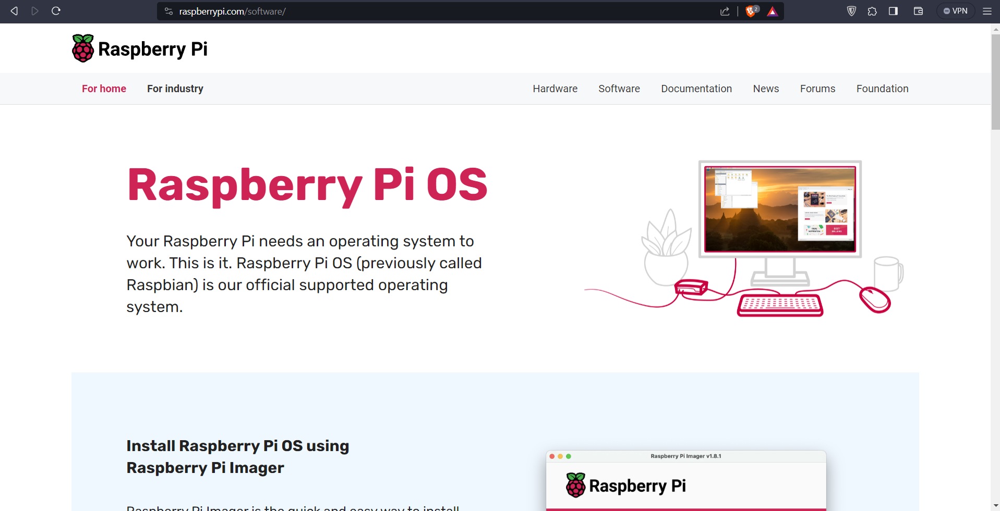

- ### Now click _**"Download for Windows"**_ or [Click this](https://downloads.raspberrypi.org/imager/imager_latest.exe) to redirect download.

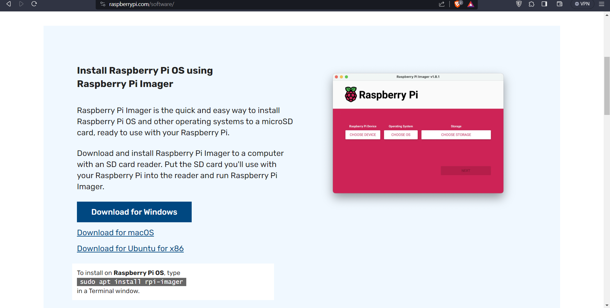

- ### Run the Downloaded file and Install

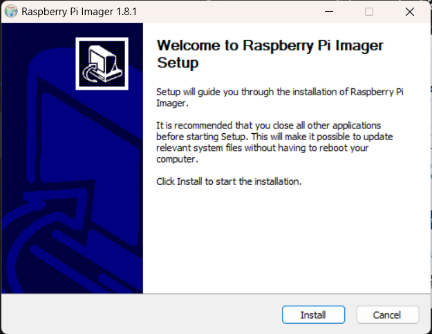

- ### Insert SD Card or Memory Card. Open the Raspberry Pi Application

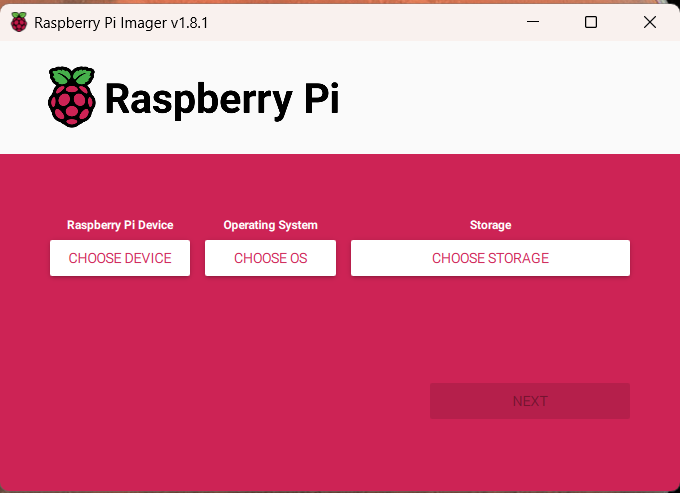

- ### Click _**"Choose Device"**_, and choose any version of Raspberry Pi Device. In this case I select Raspberry Pi 3, and then click _**"Choose OS"**_, and choose any version of Raspberry Pi Operating System. And last click _**"Choose Storage"**_, and choose where storage can you install the OS and proceed to next Step.

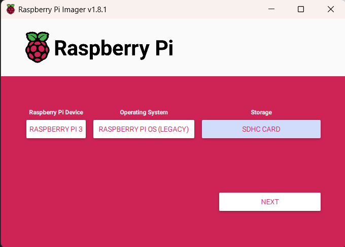

- ### Click _**"Edit settings"**_, because we need to configure some settings.

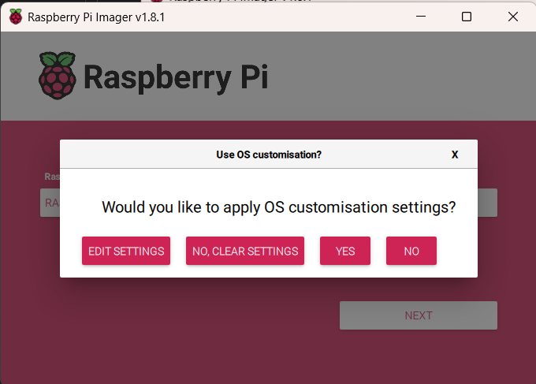

- ### Set **_username and password_**, and add **_SSID and password_**, set the **_Wireless LAN country_** to PH. In the _**"Services"**_, enable **SSH** and save it.

- ### Now click _**"Yes"**_. And now we wait until the installation is done.

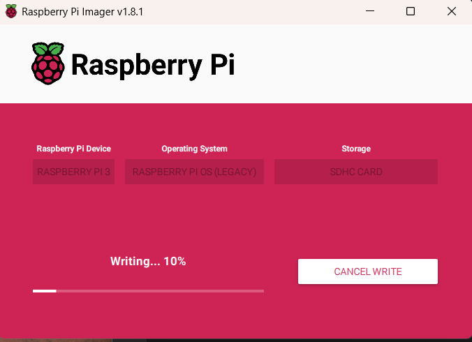

- ### Now the Raspberry Pi OS has been written to SDHC Card or SD Card. Now click Continue and remove the SD Card to your Computer.

## 2. Connecting to Raspberry Pi via SSH using terminal

- ### In the terminal, type ssh and your username and the hostname, **_"ssh username@hostname"._**

- ### Next, type **_"sudo apt update"._** After that, wait until the installation is done.

- ### Then, after the installation is complete, type again this line **_"sudo apt upgrade"._** Like the previous, wait until the process is done.

## 3. Deploying LAMP (Linux Apache MySQL PHP) Stack in Raspberry Pi

- ### Type this in terminal **_"sudo apt install apache2"_** and wait to complete.

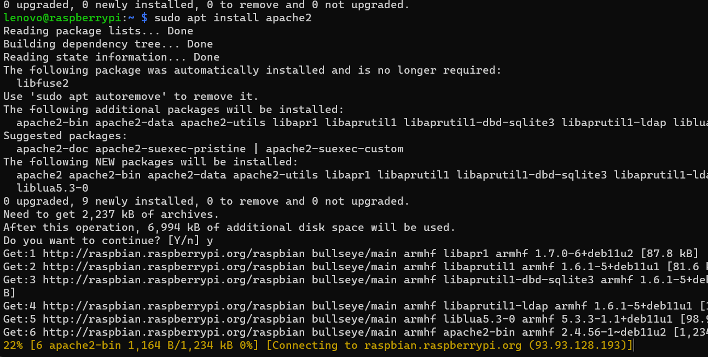

- ### Next type this command **_"sudo apt install mariadb-server"_** and wait again until the process is complete.

- ### Then, this line **_"sudo mysql_secure_installation"_**.

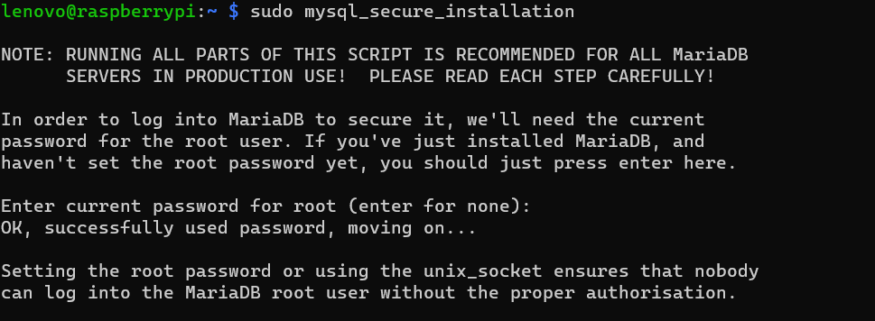

- ### After that, input this command line **_"sudo apt install php libapache2-mod-php php-mysql"_**.

- ### Then after the process is complete, type this command **_"sudo apt-get install php *"_**.

- ### Select **_"apache2"_** and click enter

- ### Lastly, type this command **_"sudo apt install phpmyadmin"_**. And wait until the process is complete.

## 4. Enabling and Controlling Raspberry Pi using VNC

- ### Download RealVNC Viewer, to download [click this](https://www.realvnc.com/en/connect/download/viewer/)

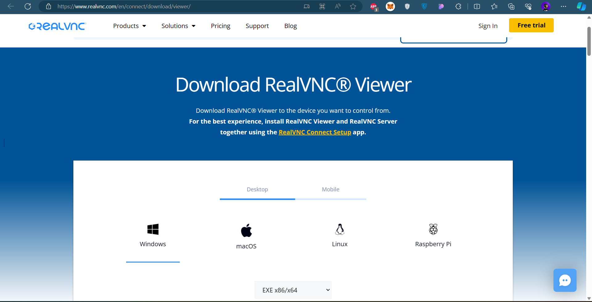

- ### Install the Downloaded file, after installing, type this in terminal **_"sudo raspi-config"_**.

- ### And then, select **_"Interface Options"_**, and click enter.

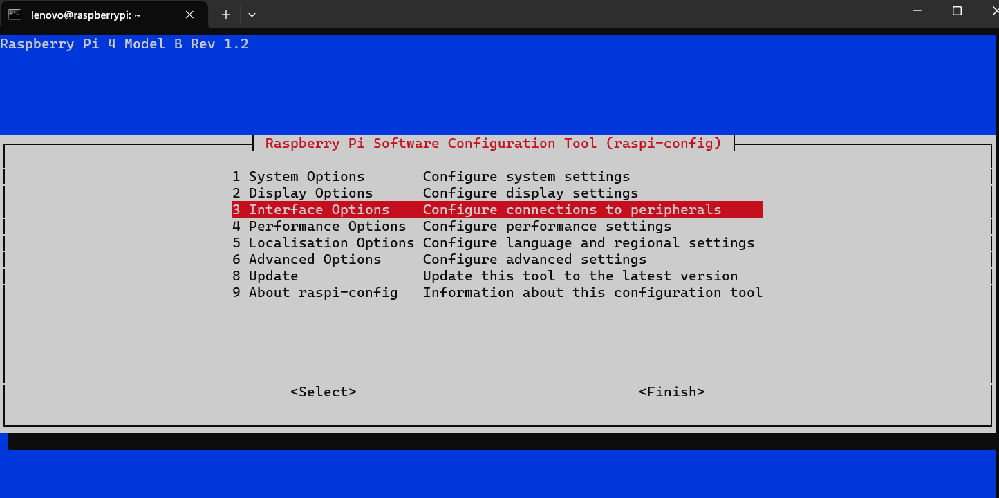

- ### Enable the VNC, click enter.

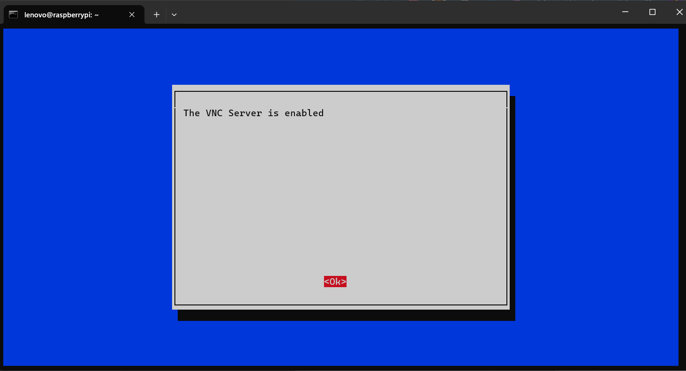

- ### Open the **_RealVNC Viewer_** app and type the ip address of your raspberry

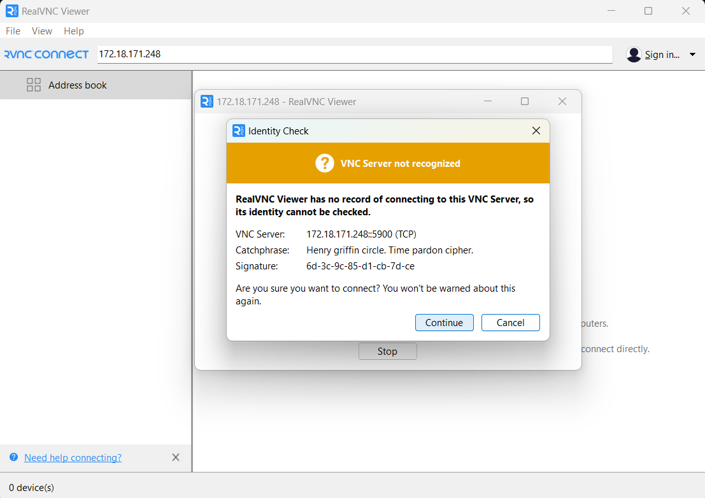

- ### Enter the username and the password and click **_"Ok"_**.

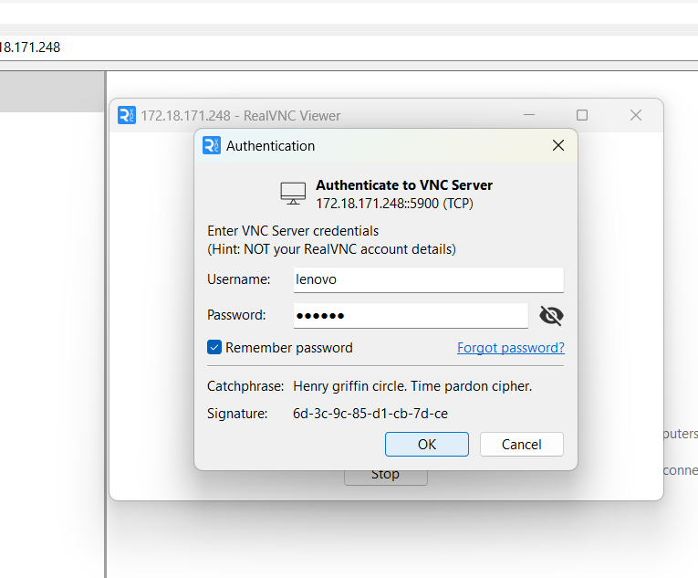

- ### Now your Raspberry setup is done.

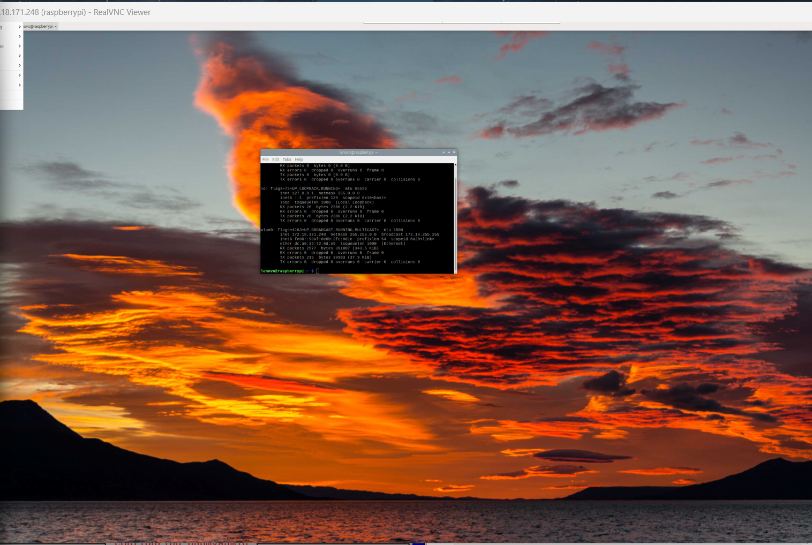